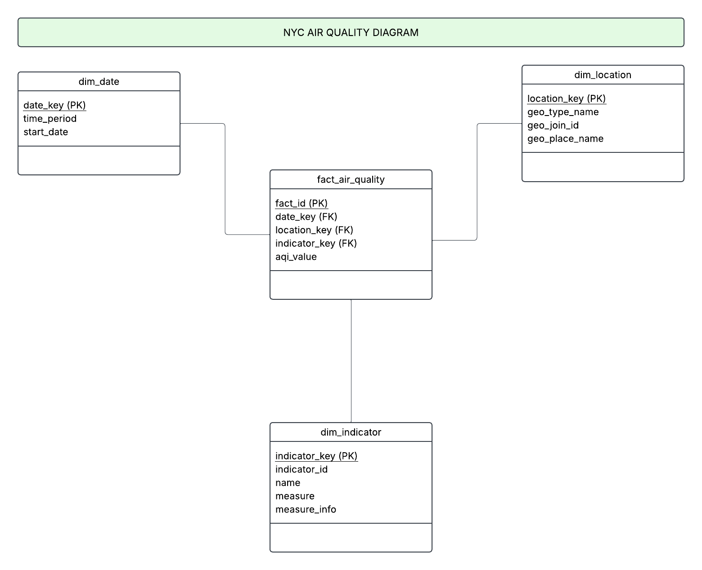

# NYC Air Quality Data Warehouse :)

Assignment 1: It includes data sourcing, data storage, and building a data warehouse model using the NYC Open Data Air Quality dataset.

## Data Source:
The data comes from NYC Open Data.  
Dataset: Air Quality  
Link: [https://data.cityofnewyork.us/Environment/Air-Quality/c3uy-2p5r ](https://data.cityofnewyork.us/Environment/Air-Quality/c3uy-2p5r/about_data) 

This dataset contains measurements of air quality indicators for different neighborhoods in New York City.

## Data Dictionary:
A full data dictionary is located in the folder:  
data_dictionary/  

It includes field names, descriptions, and data types.

## Python Script:
My script is in:  
src/process_data.py  

This script: It loads the raw CSV and selects useful columns. Renames the columns and saves a cleaned file. 

Uploads both files to Google Cloud Storage. 

To run the script, install the package:  
pip install google-cloud-storage  

Then run the script:  
python src/process_data.py  

## Storage Choice:
I created a bucket named air-quality-data-giselle, and uploaded my raw dataset (air_quality_raw.csv) directly into this bucket.

Bucket name: air-quality-data-giselle  

Files stored:  
air_quality_raw.csv

The bucket is set to be private.

## Data Warehouse Model:
This project uses a star schema with one fact table and three dimension tables.

## Dimension Tables

**dim_date**
date_key (PK)
time_period
start_date

**dim_location**
location_key (PK)
geo_type_name
geo_join_id
geo_place_name

**dim_indicator**
indicator_key (PK)
indicator_id
name
measure
measure_info

## Fact Table

**fact_air_quality**
fact_id (PK)
date_key (FK)
location_key (FK)
indicator_key (FK)
aqi_value

## Star Schema Diagram:

## SQL Script:
The SQL used to create the tables is stored in:  
sql/tables.sql  

## Project Structure:
nyc-air-quality-data-warehouse  
data  
data_dictionary  
sql/tables.sql  
src/process_data.py  
README.md  

## Cloud Storage Location:
Google Cloud Storage:  
gs://air-quality-data-giselle/ 

# Transformation, Modeling, and Visualization

## Data Transformation:
The data was transformed using SQL. 

Transformation SQL script is located in:  
sql/transform_air_quality.sql  

## Tableau Visualizations:

All visualization images are located in:  
visuals/  

## Visualization Images

Pie Chart  

Column Chart  

Line Chart  

Heat Map  

## Interactive Tableau Workbook:
The full interactive Tableau workbook can be downloaded here:  
visuals/assignment_2_nyc_air_quality.twbx  

## Live Dashboard (Amazon QuickSight)

View NYC Air Quality data that was uploaded AWS here:  
https://us-east-1.quicksight.aws.amazon.com/sn/account/8976-2744-0366/dashboards/c648b1fe-bc22-4b44-b920-8f5a2e286d83/views/b2052ffa-2b15-45d4-a762-d6920669ee8a

